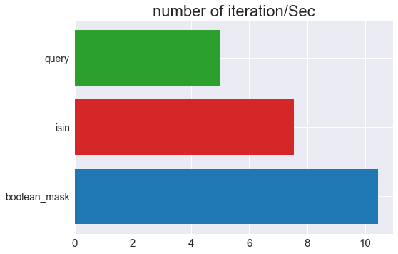

```python
import pandas as pd
import numpy as np

df = pd.DataFrame(10+60.5*np.random.randn(1000000,3))
df.columns = ['num','num2','num3']
pd.set_option('float_format', '{:f}'.format)
df.describe()
```

<div>
<style scoped>
    .dataframe tbody tr th:only-of-type {
        vertical-align: middle;
    }

    .dataframe tbody tr th {
        vertical-align: top;
    }

    .dataframe thead th {
        text-align: right;
    }
</style>
<table border="1" class="dataframe">
  <thead>
    <tr style="text-align: right;">
      <th></th>
      <th>num</th>
      <th>num2</th>
      <th>num3</th>
    </tr>
  </thead>
  <tbody>
    <tr>
      <th>count</th>
      <td>1000000.000000</td>
      <td>1000000.000000</td>
      <td>1000000.000000</td>
    </tr>
    <tr>
      <th>mean</th>
      <td>10.007589</td>
      <td>10.056873</td>
      <td>9.939045</td>
    </tr>
    <tr>
      <th>std</th>
      <td>60.415315</td>
      <td>60.521844</td>
      <td>60.451203</td>
    </tr>
    <tr>
      <th>min</th>
      <td>-282.352587</td>
      <td>-287.677283</td>
      <td>-300.389316</td>
    </tr>
    <tr>
      <th>25%</th>
      <td>-30.753797</td>
      <td>-30.790218</td>
      <td>-30.822618</td>
    </tr>
    <tr>
      <th>50%</th>
      <td>9.997371</td>
      <td>10.014887</td>
      <td>9.953583</td>
    </tr>
    <tr>
      <th>75%</th>
      <td>50.746170</td>
      <td>50.891101</td>
      <td>50.660364</td>
    </tr>
    <tr>
      <th>max</th>
      <td>308.740897</td>
      <td>292.197571</td>
      <td>294.566926</td>
    </tr>
  </tbody>
</table>
</div>


```python
# 10 < num < 100
# 0.5 < num2 < 10
# 255 < num3 < 50

result = df.query('10 < num < 100 & 0.5 < num2 < 10 & 25< num3 < 50')

len(result)   >>>  3982

BM = (df['num'] > 10) & (df['num'] < 100)
BM2 = (df['num2'] > 0.5) & (df['num2'] < 10)
BM3 = (df['num3'] > 25) & (df['num3'] < 50)

result = df[BM & BM2 & BM3]

len(result)  >>> 3982 

```


```python
# query도 변수 사용 가능
#10 < num < 20
a = 10
b = 20
result = df.query('@a < num <@b') #  @를 붙이면 변수 취급

```


```python
sub_station = pd.read_csv('\sub_station.csv',encoding='CP949')

# 검색용 Good!!
sub_station.query('역사명 == "김포공항"')

```


<div>
<style scoped>
    .dataframe tbody tr th:only-of-type {
        vertical-align: middle;
    }

    .dataframe tbody tr th {
        vertical-align: top;
    }

    .dataframe thead th {
        text-align: right;
    }
</style>
<table border="1" class="dataframe">
  <thead>
    <tr style="text-align: right;">
      <th></th>
      <th>역사_ID</th>
      <th>역사명</th>
      <th>호선</th>
      <th>경도</th>
      <th>위도</th>
    </tr>
  </thead>
  <tbody>
    <tr>
      <th>2</th>
      <td>4929</td>
      <td>김포공항</td>
      <td>김포골드라인</td>
      <td>126.801868</td>
      <td>37.562360</td>
    </tr>
    <tr>
      <th>88</th>
      <td>4207</td>
      <td>김포공항</td>
      <td>공항철도1호선</td>
      <td>126.801904</td>
      <td>37.561842</td>
    </tr>
    <tr>
      <th>130</th>
      <td>4102</td>
      <td>김포공항</td>
      <td>9호선</td>
      <td>126.802152</td>
      <td>37.561916</td>
    </tr>
    <tr>
      <th>352</th>
      <td>2513</td>
      <td>김포공항</td>
      <td>5호선</td>
      <td>126.801292</td>
      <td>37.562384</td>
    </tr>
  </tbody>
</table>
</div>


```python
# 여러 value 동시 검색 가능

stations = ['김포공항', '신논현']
sub_station.query('역사명 == @stations').sort_values(by='역사명',ascending=False)
```


<div>
<style scoped>
    .dataframe tbody tr th:only-of-type {
        vertical-align: middle;
    }

    .dataframe tbody tr th {
        vertical-align: top;
    }

    .dataframe thead th {
        text-align: right;
    }
</style>
<table border="1" class="dataframe">
  <thead>
    <tr style="text-align: right;">
      <th></th>
      <th>역사_ID</th>
      <th>역사명</th>
      <th>호선</th>
      <th>경도</th>
      <th>위도</th>
    </tr>
  </thead>
  <tbody>
    <tr>
      <th>107</th>
      <td>4125</td>
      <td>신논현</td>
      <td>9호선</td>
      <td>127.025060</td>
      <td>37.504598</td>
    </tr>
    <tr>
      <th>2</th>
      <td>4929</td>
      <td>김포공항</td>
      <td>김포골드라인</td>
      <td>126.801868</td>
      <td>37.562360</td>
    </tr>
    <tr>
      <th>88</th>
      <td>4207</td>
      <td>김포공항</td>
      <td>공항철도1호선</td>
      <td>126.801904</td>
      <td>37.561842</td>
    </tr>
    <tr>
      <th>130</th>
      <td>4102</td>
      <td>김포공항</td>
      <td>9호선</td>
      <td>126.802152</td>
      <td>37.561916</td>
    </tr>
    <tr>
      <th>352</th>
      <td>2513</td>
      <td>김포공항</td>
      <td>5호선</td>
      <td>126.801292</td>
      <td>37.562384</td>
    </tr>
  </tbody>
</table>
</div>


```python
import matplotlib.pyplot as plt

# matplotlib 폰트설정
plt.rc('font', family='NanumGothic') # For Windows
plt.rcParams['font.family']

# plt 스타일 
plt.style.use('seaborn')

asd = pd.DataFrame([10.44,7.55,5.02]).T
asd.columns = ['boolean_mask','isin','query']
plt.figure(figsize=(8,6))
plt.barh(asd.columns, asd.values[0],color=['tab:blue','tab:red','tab:green'])
plt.xticks(fontsize=15)
plt.yticks(fontsize=14)
plt.title('number of iteration/Sec',fontsize=22)
plt.show()

```


    

    


```python
## query
stations = ['김포공항', '신논현','여의도','여의나루']
sub_station.query('역사명 == @stations').sort_values(by='역사명',ascending=False)

## isin
stations = ['김포공항', '신논현','여의도','여의나루']

BM = sub_station['역사명'].isin(stations)
sub_station[BM].sort_values(by='역사명',ascending=False)


## boolean mask
BM1 = sub_station['역사명'] == '김포공항'
BM2 = sub_station['역사명'] == '신논현'
BM3 = sub_station['역사명'] == '여의도'
BM4 = sub_station['역사명'] == '여의나루'

sub_station[BM1 | BM2 | BM3 | BM4].sort_values(by='역사명',ascending=False)
```

<div>
<style scoped>
    .dataframe tbody tr th:only-of-type {
        vertical-align: middle;
    }

    .dataframe tbody tr th {
        vertical-align: top;
    }

    .dataframe thead th {
        text-align: right;
    }
</style>
<table border="1" class="dataframe">
  <thead>
    <tr style="text-align: right;">
      <th></th>
      <th>역사_ID</th>
      <th>역사명</th>
      <th>호선</th>
      <th>경도</th>
      <th>위도</th>
    </tr>
  </thead>
  <tbody>
    <tr>
      <th>117</th>
      <td>4115</td>
      <td>여의도</td>
      <td>9호선</td>
      <td>126.924030</td>
      <td>37.521760</td>
    </tr>
    <tr>
      <th>338</th>
      <td>2527</td>
      <td>여의도</td>
      <td>5호선</td>
      <td>126.924357</td>
      <td>37.521747</td>
    </tr>
    <tr>
      <th>337</th>
      <td>2528</td>
      <td>여의나루</td>
      <td>5호선</td>
      <td>126.932901</td>
      <td>37.527098</td>
    </tr>
    <tr>
      <th>107</th>
      <td>4125</td>
      <td>신논현</td>
      <td>9호선</td>
      <td>127.025060</td>
      <td>37.504598</td>
    </tr>
    <tr>
      <th>2</th>
      <td>4929</td>
      <td>김포공항</td>
      <td>김포골드라인</td>
      <td>126.801868</td>
      <td>37.562360</td>
    </tr>
    <tr>
      <th>88</th>
      <td>4207</td>
      <td>김포공항</td>
      <td>공항철도1호선</td>
      <td>126.801904</td>
      <td>37.561842</td>
    </tr>
    <tr>
      <th>130</th>
      <td>4102</td>
      <td>김포공항</td>
      <td>9호선</td>
      <td>126.802152</td>
      <td>37.561916</td>
    </tr>
    <tr>
      <th>352</th>
      <td>2513</td>
      <td>김포공항</td>
      <td>5호선</td>
      <td>126.801292</td>
      <td>37.562384</td>
    </tr>
  </tbody>
</table>
</div>


